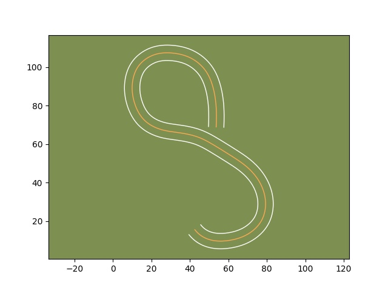
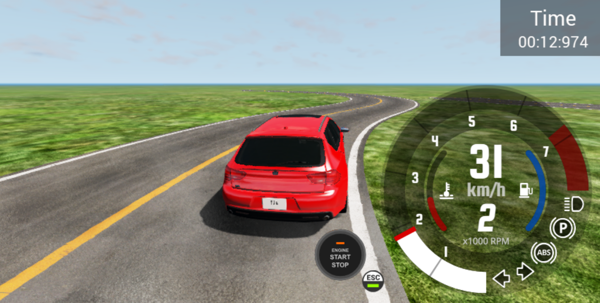
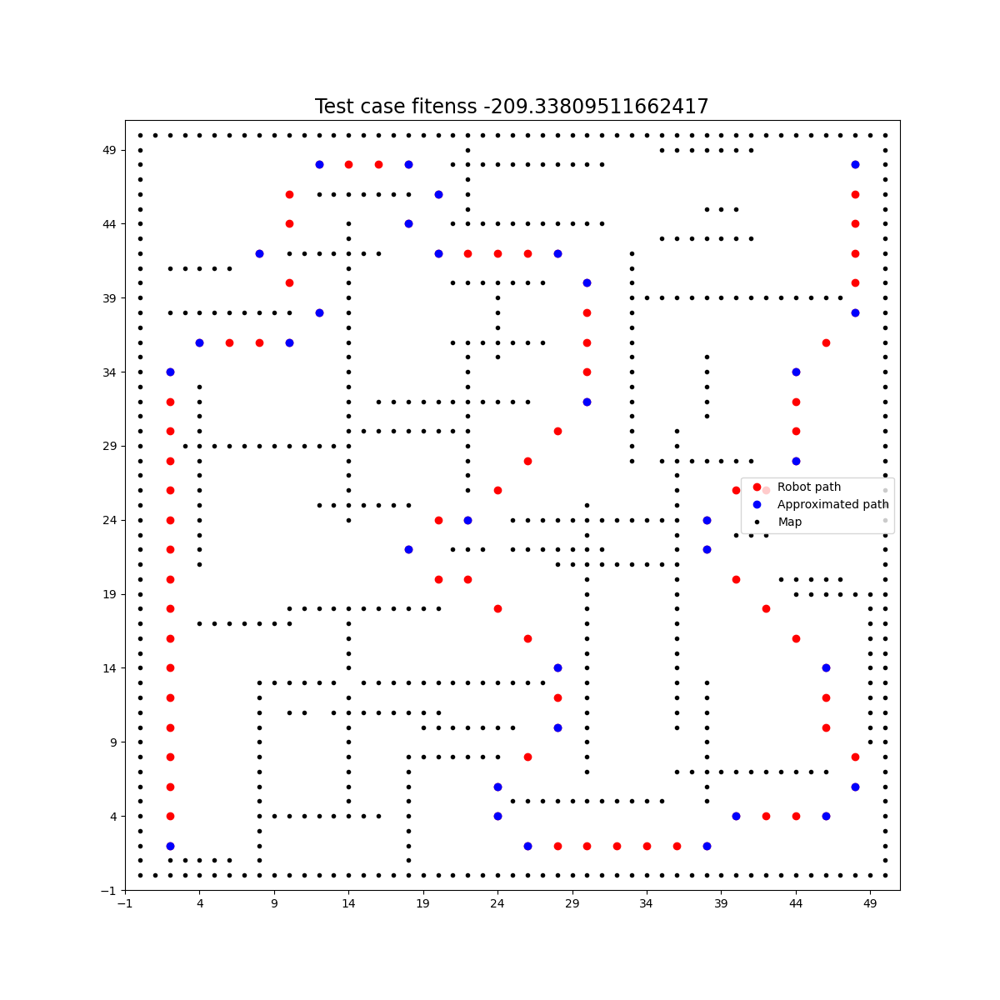
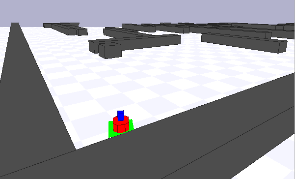

# Environment_generation
## Description
This repository contains the replicatioin package for the experiments conducted in our paper "A Search-Based Framework for Automatic Generation of TestingEnvironments for Cyber-Physical Systems". 
In *RQ1 and RQ2* we compare the performance of the random search, single and multi objective evolutionary algorithms for generating scenarios for three cyber-physical systems: smart thermostat, autonomous robot and vehicle lane keeping assist system.
In *RQ3* we are evaluating how many faults can reveal the scenario we generate for the autonomous robot and vehicle lane keeping assist system.
Instrucrtions to run the experiments are provided in the corresponding folders.
Scenario for the vehicle system (a road configuration)| Execution of the scenario in the BeamNg simulator | 
:-------------------------:|:-------------------------:|
  |  | 

Scenario for the autonomous robot (a map with obstacles)| Execution of the scenario in the Player/Stage simulator | 
:-------------------------:|:-------------------------:|
  |  | 
